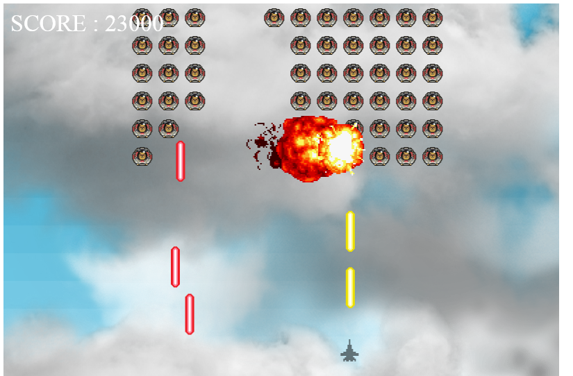

# WebGlGame

This is my first attempt to create a WebGl game. Phaser.js library has been used. It runs in the browser, so just download the files and put them together in one directory, then open "index2.html" to play the game. 

